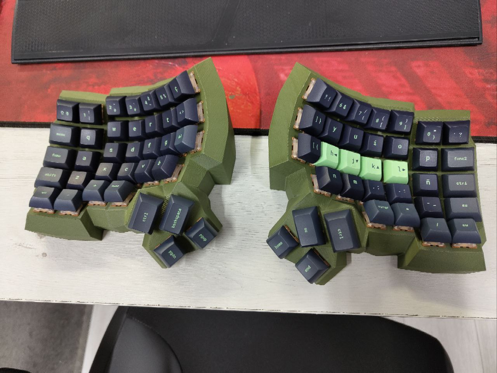
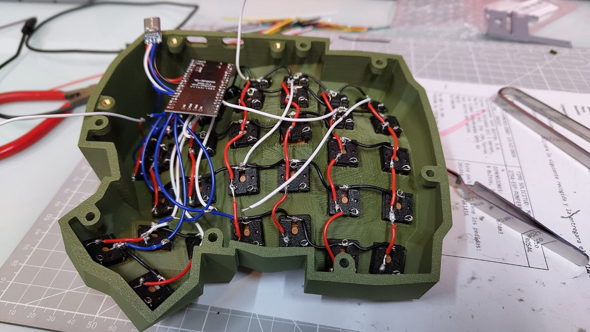
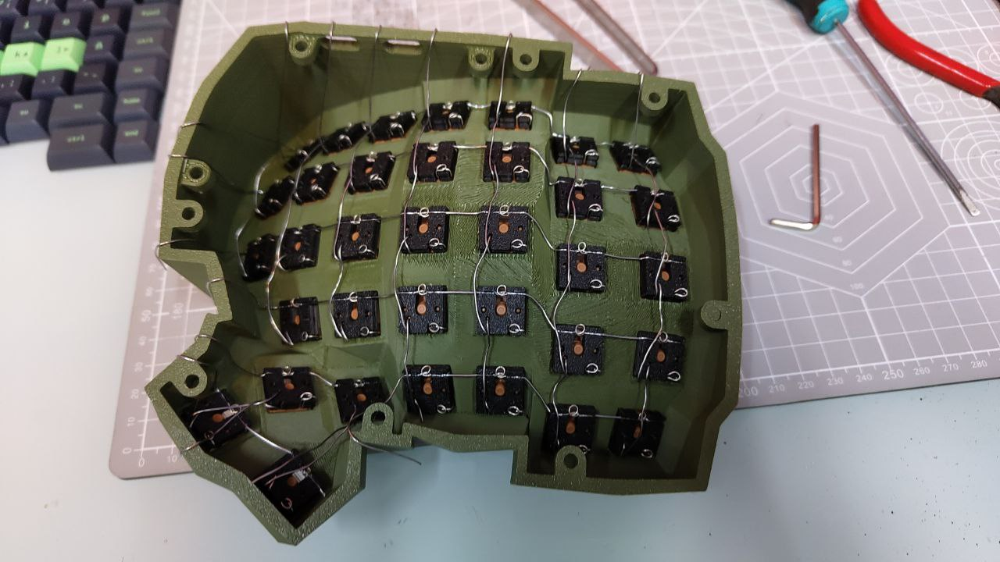

# Keytres

Since the Redox keyboard, I wanted to build another one, and I would love to try
dactyl, but was too lazy for designing mine from ground up. But searching 3d
cases over the internet, I found out Cosmos, a web-based tool for 3D modeling.
Keyboards of any type. So I started tinkering on the web, printing some tests, and
When I wanted to realize it, I was already building the keyboard... another
keyboard for the collection 🎉.

I want it to make it hot-swappable, I just don't understand how other keyboards
like the Kinesis 360 are not, or you have to hack it. This doesn't take that I
want to try (or have) one :)

## Components
> **__NOTE:__** All the links are at the end of the page.

- Case: Made with Cosmos and a 3D printer
- Hot-swappable socket: 3D printed
- USB-C shell: 3D printed
- Keycaps: [Superuser](../../keycaps/superuser/README.md)
- Switches: [Gateron Mars Switch](https://keysme.com/products/gateron-mars-switch)
- Board: RP2040 board (Raspberry Pi Pico)
- Connection: Wire with plastic cover to prevent cross connections

## Assembly
The assembly process presented several hurdles. Initially, I encountered issues
with wiring that led to false connections, forcing me to restart the project
and modify the wiring by adding wires with plastic sleeves. While insulation
could have been an option, I was wary of potential future problems it might
cause and experience had shown me that this approach often led to more
complications down the line. Instead, I opted for a different solution:
soldering the wires together directly. Though the setup isn't visually
appealing, it gets the job done reliably and will be concealed once the
keyboard is assembled, so appearance wasn’t a major concern at that stage.

## Firmware
I use ES layout on my computer, and there were some keys I wanted from the US
layout, so I changed some keys to help me program more comfortably.
I will update the firmware in my repo, you have the link down.

## Conclusion
Update when I have tried more :)

## Assets

## Links
Cosmos case: [Link](https://ryanis.cool/cosmos/beta#cm:CtEBCg8SBRCAPyAnEgASABIAODEKDxIFEIBLICcSABIAEgA4HQocEgUQgFcgJxIAEgASAxCwLxIDELBfOAlAgIDUAQocEgUQgGMgJxIAEgASAxCwOxIDELBrOApAgICEAQobEgcQgG8gJ0AUEgASABIAEgIQMDgeQICOh7ACChUSBCAnQBQSBBAwIChAgI6HsAJQ9gMKHBIEEBAgExIEEKCAChICEDAwgChAgI6HsAJQjgQKERICICcSABIAOEVAKEiAtLkUGABA6IWgrvBVSNzwomAKdApSEhMQwIACIABAi4XYlhBIjYWAwN0NEhAQQCAAQJrElghIjYWAwN0NEhIIgCAgAECthdwDSJmJhJ7g3BASEwiAICAAQOKD2NABSOmTnJeg8BE4ABgCIgoIyAEQyAEYACAAMIAwQJ+NnK3wM0imqeDG8LMIIgYYhAcg+guCAQeCAQCCAY8DWEdoAHIHkAHlAhDlAg==)
Hot-swappable: [Link](https://github.com/stingray127/handwirehotswap)
Usb-C shell (original): [Modded](./TypeCShell.stl) | [Original](https://makerworld.com/en/models/897484-type-c-shell-for-female-usb-connector-board?from=search#profileId-855812)
Firmware: [Link](https://github.com/TheJltres/keytres)
