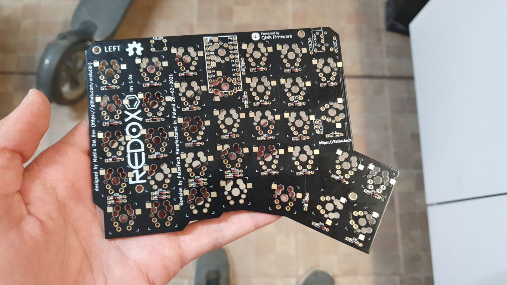
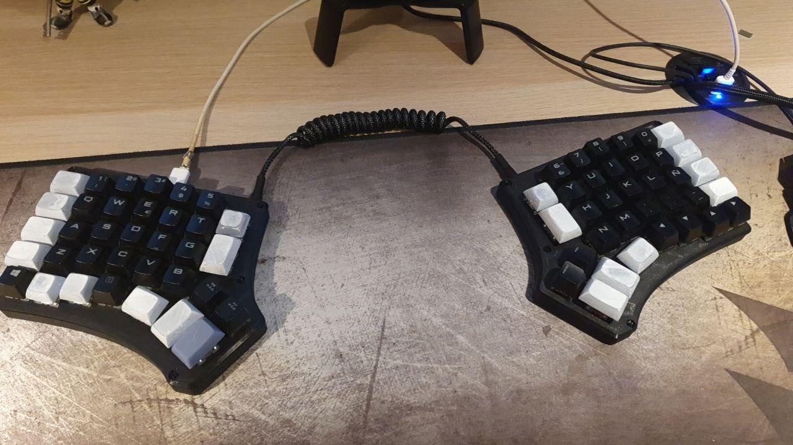
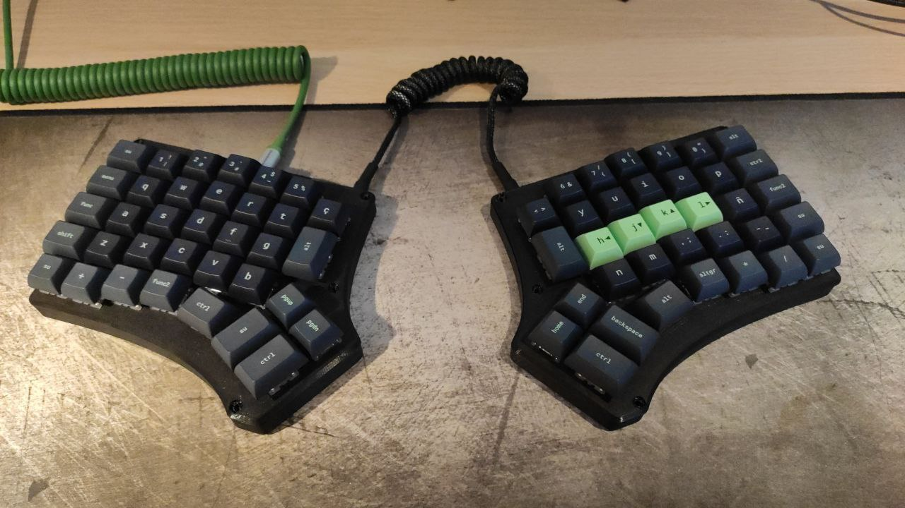

# Redox: My First DIY Keyboard
It was an exciting journey that taught me valuable lessons in electronics and
soldering.

## Components
- **Motherboard**: Purchased from
  [falbatech](https://falbatech.click/products/redox-partially-assembled-with-electronics-cables),
  it was easy to work with and very straightforward.
- **Switches**: I used hot-swappable [MX Cherry Silent
  Red](https://www.cherry.de/es-es/producto/mx-rgb-silent-red-switch-kit)
  switches with MilMax, which provided a nice balance of silent clicks and a comfortable
  feel.
- **Firmware**: Programmed using [QMK](https://qmk.fm/) with an STM32 Blue pill
  board. The documentation for Redox was very helpful during this process.

## Assembly
The assembly itself was straightforward. However, soldering the MilMax switches
initially presented a challenge. It took me a few attempts to get used to it,
but once I got the hang of it, everything went smoothly. When everything was
connected, the keyboard functioned flawlessly, with every key responding as
intended.

## Challenges
Despite the initial success, after a few days, I realized something was
bothering me. I tried adding some tilt using the official supports, but they
ended up being too high for comfortable typing. This led me to switch back to
my old keyboard for daily use, leaving Redox as just a tinkering project.

## Conclusion
Building Redox was an incredibly rewarding experience, despite its
shortcomings. It ignited my passion for DIY electronics and taught me valuable
lessons in problem-solving. Currently, Redox rests in my drawer, serving as a
testament to my growth as a builder and the joy of creating something from
scratch.

This journey has left me with lasting memories and skills that I have already
applied in other projects.

## Assets

